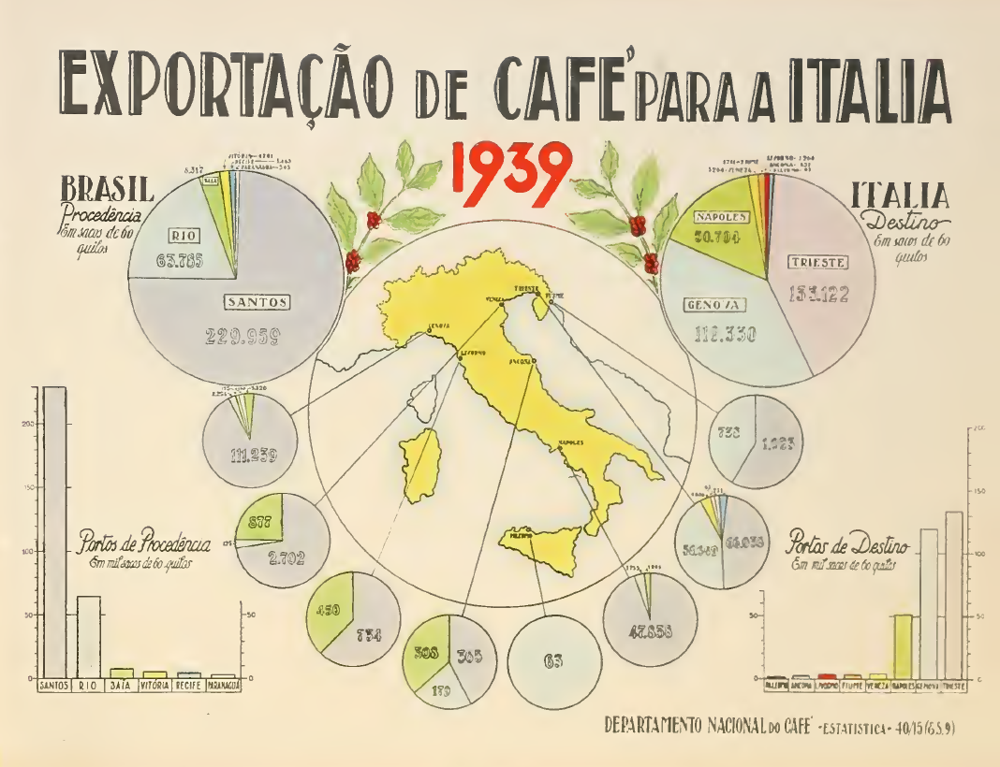

# График EXPORTAÇÃO de CAFE'para a ITALIA, 1939
(English version below 👇)

В беседе о графиках в прекрасном сообществе ["Дата-Арт: Цветы и Цифры"](https://t.me/dataart_practice) показали интересный сборник бразильской статистики о торговле кофе. В нём была активно использовались круговые диаграммы для визуализации .. динамики торговли! Ужас, с точки зрения современного датавиза, но картинки оказались залипательно завораживающими. 

Появилась идея повторить это современными инструментами  

[Nadya 🍁](https://t.me/designing_numbers)

[Юрий](https://t.me/People_Analytics)

# Chart EXPORTAÇÃO de CAFE'para a ITALIA, 1939
(Версия на русском выше 👆)

